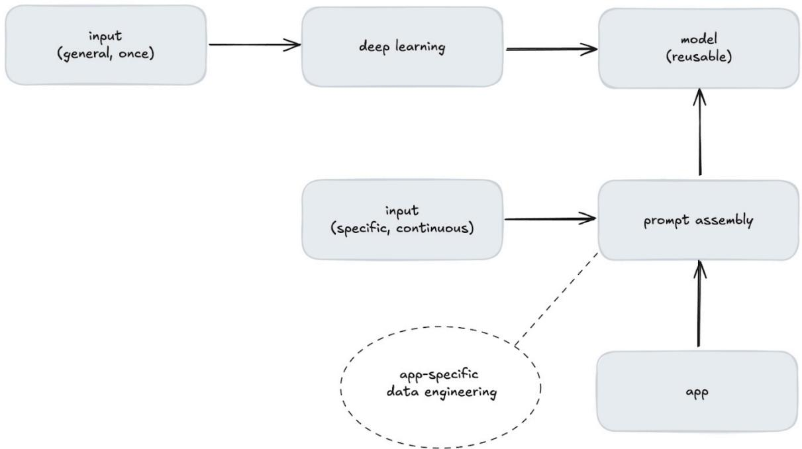
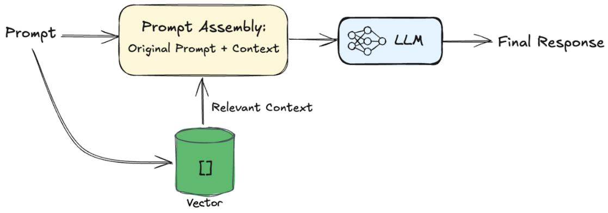
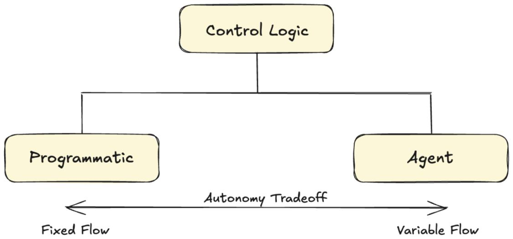
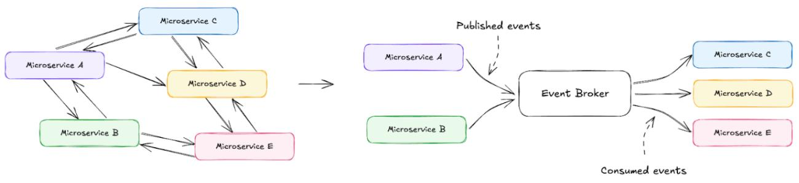
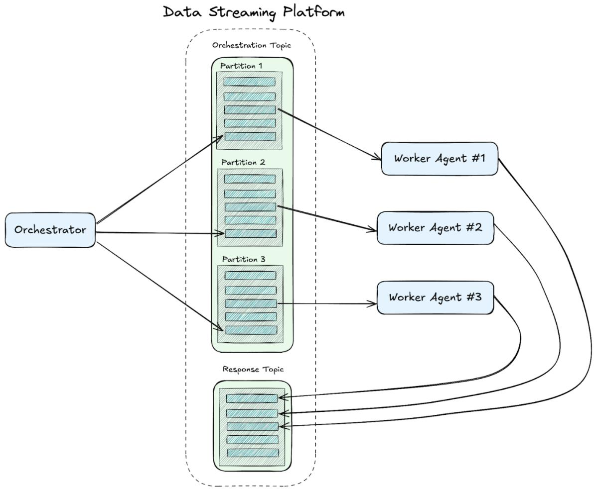
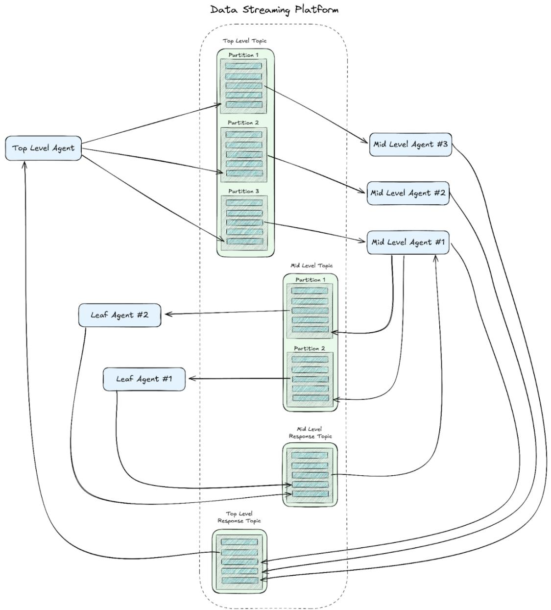
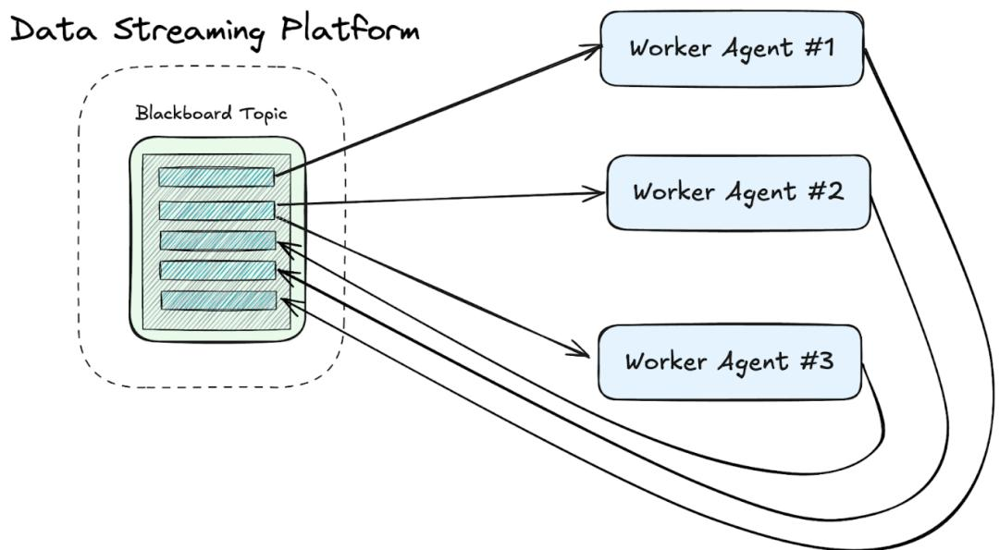
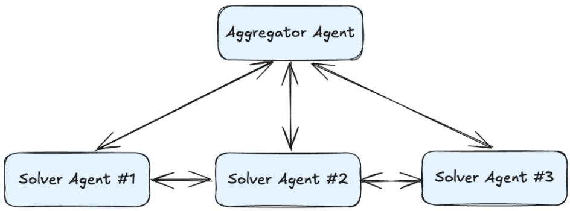
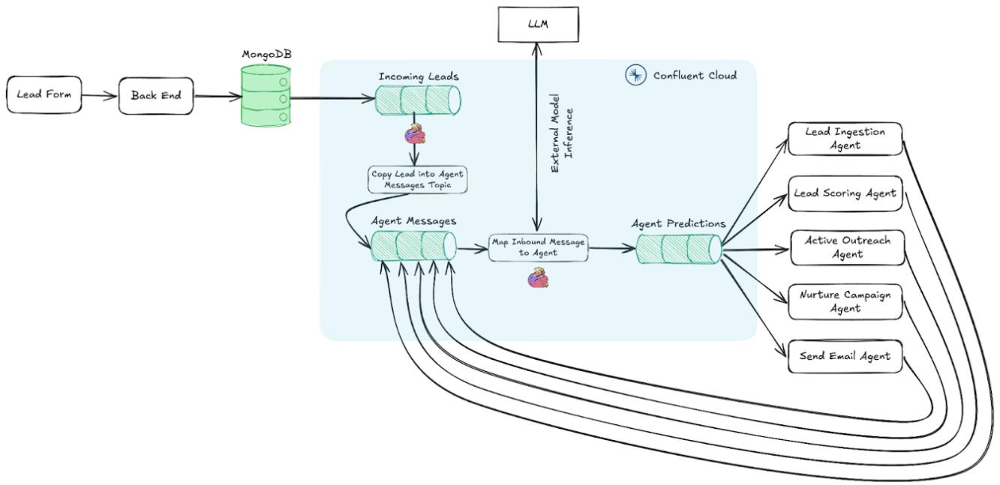

# A Guide to Event-Driven Design for Agents and Multi-Agent Systems

By Sean Falconer, AI Entrepreneur in Residence, Confluent

# Contents

# 3 Introduction

# 4 Part I: Understanding the Evolution of AI

The First Wave: Predictive AI

The Second Wave: Generative AI

Compound AI Bridges the Gap

The Third Wave: Agentic AI

The Power of Singular Agent Systems

# 9 Part II: The Case for Event-Driven Agentic Systems

The Anatomy of an Agent

Persona (Job Function)

Perception (Sensing)

Reasoning and Decision-Making

Memory

Planning

Action

Learning

Coordination and Collaboration

Tool Interface

Why Event-Driven Matters for Agents

From Singular to Multi-Agent Systems

# Part III: Design Patterns for Multi-Agent Systems13

Multi-Agent Design Patterns

Orchestrator-Worker Pattern

Traditional Approach

Event-Driven Approach

Hierarchical Agent Pattern

Traditional Approach

Event-Driven Approach

Blackboard Pattern

Traditional Approach

Event-Driven Approach

Market-Based Pattern

Traditional Approach

Event-Driven Approach

The Role of the Data Streaming Platform in Multi-Agent Systems

# Part IV: Building Event-Driven Systems for Agents with a Data Streaming Platform23

Architecting Singular and Multi-Agent Systems

Challenges and Solutions in Event-Driven Agent Design

[Stream] Next-Level Data Streaming with a Fully Managed, Cloud-Native Service

[Connect] Seamless Integration: Connecting Agents with Diverse Systems

[Process] Ensuring Data Freshness: Handling Dynamic Data Streams

[Govern] Data Quality, Security, and Compliance

Real-World Applications of Event-Driven Agentic Systems

1. Automating Web Scraping with AI Agents

2. Intelligent Business Copilots

3. Workflow Automation with a Drag-and-Drop Agent Builder

Broader Industry Impact

Why a Data Streaming Platform Is Essential for AI Agents

# The Future of AI is Event-Driven28

# Take the Next Step29

# Introduction

AI has come a long way. We’ve moved from predictive models that analyze patterns to generative AI that creates new content. Now, we’re entering the next phase: agentic AI— systems that don’t just generate, but have the agency to act, adapt, and collaborate, in real time.

For AI agents to be useful, they need more than just intelligence. They need infrastructure. They need security. They need governance.

An agent must consume data, use tools, make decisions, and share outputs across an organization. But rigid, request-driven architectures can’t keep up. APIs and synchronous workflows create bottlenecks, limit scalability, and make coordination between multiple agents a nightmare. The future of AI agents isn’t about making models better, it’s about making AI systems work together seamlessly.

This demands an event-driven architecture (EDA) powered by a data streaming platform, which enables agents to react dynamically to changes, share state efficiently, and scale without the constraints of traditional request-response patterns. A data streaming platform not only facilitates real-time event processing, but also ensures governance, enforces data quality, and connects disparate data sources into a unified stream.

By processing data close to the source, it reduces latency and enhances decisionmaking, allowing AI agents to operate with the freshest, most relevant data, while maintaining compliance and control across the organization.

EDA transforms AI from isolated models into a dynamic system of agents that react to events in real time. By using a data streaming platform, agents can consume, process, and emit events asynchronously, ensuring scalable, flexible, and resilient interactions. Whether it’s a single agent handling customer queries, or a network of agents optimizing a supply chain, event-driven design ensures they stay in sync, without breaking down under complexity.

This ebook is a guide to building eventdriven AI agents and multi-agent systems. We’ll cover the evolution of AI, the anatomy of an agent, design patterns for scalable architectures, and real-world applications. At the core of this approach is a data streaming platform, which enables agents to consume, process, and act on real-time data, while maintaining governance and scalability. The goal is simple: to demonstrate why eventdriven design—powered by a data streaming platform—is the backbone of AI’s next evolution, and how to architect systems that are not only effective today, but are built for long-term scalability and adaptability.

# Part I: Understanding the Evolution of AI

AI has evolved through three distinct phases, each unlocking new capabilities, while introducing its own limitations.

# The First Wave: Predictive AI

The first wave of AI revolved around traditional machine learning, focusing on predictive capabilities for narrowly defined tasks.

  
The Traditional Machine Learning Workflow

Building these models required significant expertise, as they were crafted specifically for individual use cases. They were domain-specific, with their domain specificity embedded in the training data, making them rigid and tough to repurpose. Adapting a model to a new domain often meant starting from scratch—an approach that lacked scalability and slowed adoption.

# The Second Wave: Generative AI

Generative AI, driven by deep learning, marked a turning point.

Instead of being confined to single domains, these generative models were trained on vast, diverse datasets, giving them the ability to generalize across a variety of contexts. They could generate text, images, and even videos, opening up exciting new applications. Whereas predictive AI relies on traditional batch-based statistical models to solve specific problems, generative AI uses foundation models like LLMs that are broadly capable and reusable:

  
The Generative AI Workflow

However, this wave came with its own challenges.

Generative models are fixed in time—unable to incorporate new or dynamic information— and are difficult to adapt. Fine-tuning can address domain-specific needs, but it’s expensive and error-prone. Fine-tuning requires vast data, significant computational resources, and ML expertise, making it impractical for many situations. Additionally, since LLMs are trained on publicly available data, they don’t have access to domain-specific information, limiting their ability to accurately respond to questions that require context.

For example, suppose you ask a generative model to recommend an insurance policy tailored to a user’s personal health history, location, and financial goals.

  
Simple Prompt and Response with an LLM

In this scenario, you prompt the LLM and it generates a response. Clearly the model can’t deliver accurate recommendations, because it lacks access to the relevant user data. Without it, the response will either be generic or flat-out wrong.

# Compound AI Bridges the Gap

To overcome these limitations, Compound AI systems integrate generative models with other components like programmatic logic, data retrieval mechanisms, and validation layers. This modular design allows AI to combine tools, fetch relevant data, and tailor outputs in a way that static models cannot.

For instance, in the insurance recommendation example:

• A retrieval mechanism pulls the user’s health and financial data from a secure database.   
• This data is added to the context provided to the LLM during prompt assembly.   
• The LLM uses the assembled prompt to generate an accurate response.

  
Simple RAG Architecture

This process, known as Retrieval-Augmented Generation (RAG), bridges the gap between static AI and real-world needs by dynamically incorporating relevant data into the model’s workflow.

While RAG effectively handles tasks like this, it relies on fixed workflows, meaning every interaction and execution path must be predefined. This rigidity makes it impractical to handle more complex or dynamic tasks, where workflows cannot be exhaustively encoded. Encoding all possible execution paths manually is labor-intensive and ultimately limiting.

The limitations of fixed-flow architectures have led to the rise of the third wave of AI: agentic systems.

# The Third Wave: Agentic AI

As HubSpot CTO Dharmesh Shah put it, “Agents are the new apps.” Salesforce CEO Marc Benioff echoed this sentiment on The Wall Street Journal’s “Future of Everything” podcast, emphasizing that the future of AI lies with autonomous agents—systems that can think, adapt, and act independently.

Agents bring something fundamentally new: dynamic, context-driven workflows. Unlike traditional AI models that follow predefined paths, agentic systems determine the best course of action on the fly, adapting in real time to the challenges they face. This makes them particularly well-suited for solving complex, interconnected problems, in enterprise environments.

  
Control Logic: Programmatic vs. Agentic

Agents flip traditional control logic on its head.

Instead of rigid programs dictating every move, agents use LLMs to drive decisions. They can reason, use tools, and access memory—all dynamically. This flexibility allows for workflows that evolve in real time, making agents far more powerful than anything built on fixed logic.

  
Agent Architecture (inspired by https://arxiv.org/pdf/2304.03442)

# The Power of Singular Agent Systems

A single agent can be powerful when designed correctly. Effective AI agents share key characteristics:

• Autonomy: They operate without constant human intervention.   
• Adaptability: They adjust to new data and changing conditions.   
• Decision-Making: They evaluate multiple options and select the best course of action.

However, traditional architectures make deploying such agents challenging.

AI systems struggle with data freshness, integration complexity, security, governance, and realtime responsiveness. Many still rely on batch-based processing, leading to decisions made based on stale data, while fragmented data landscapes make it difficult to establish contextualized and trustworthy data. These challenges create a data mess, where agents lack the reliable, realtime inputs needed to make effective decisions. This highlights the need for an event-driven foundation powered by a data streaming platform, where agents can securely react to live events, enforce governance, and integrate data from disparate sources in real time—eliminating bottlenecks, and enabling AI systems to operate with speed, accuracy, and compliance.

Before we explore why event-driven design is critical, we need to break down the fundamental components of an agent. Understanding the anatomy of an agent provides the foundation for architecting scalable, interoperable AI systems.

# Part II: The Case for Event-Driven Agentic Systems

In artificial intelligence, agents have a long history, from early theoretical considerations by Alan Turing and John McCarthy, to rule-based reasoning agents in the 1960s. These agents were designed to act autonomously within a defined context, but their capabilities were limited by narrow applications and rigid logic.

Today, the emergence of foundation models has transformed what’s possible.

# The Anatomy of an Agent

Just like humans, agents solve problems by combining their senses, memory, reasoning, and ability to act. But before diving into these mechanics, there’s one foundational element that underpins everything: their persona.

  
The Anatomy of an Agent

# Persona (Job Function)

The persona of an agent defines its job function and expertise. It’s like a detailed job description embedded into the system prompt, shaping the agent’s behavior and responses. The system prompt sets expectations, and influences the model’s probability distribution over tokens, to align outputs with the defined role.

# Perception (Sensing)

With a clear role, the first step to solving any problem is understanding the environment. For agents, perception is their sensory input—how they gather data from the world around them. Humans use eyes, ears, and touch; agents use APIs, sensors, and user inputs.

# Reasoning and Decision-Making

Once information is gathered, it needs to be processed and understood. Reasoning is the agent’s ability to analyze data, derive insights, and decide what to do next. For humans, this happens in the brain. For agents, it’s powered by models like LLMs, which dynamically adapt to inputs and contexts.

# Memory

Memory allows agents to retain domain-specific information across interactions. It’s not about learning, which is a separate part of the anatomy. Humans rely on both short-term memory (like recalling the start of a conversation) and long-term memory (like remembering a skill learned years ago). Agents work the same way.

Short-term memory allows the agent to keep track of the immediate context within a conversation, which might be stored temporarily in memory buffers during the session. Meanwhile, long-term memory involves storing historical data, such as user preferences or past interactions. This could be a vector database like MongoDB, Elasticsearch, Pinecone, or another permanent storage. A vector database enables semantic search, where embeddings allow the agent to retrieve relevant information efficiently.

# Planning

Once the agent knows what needs to be done, it devises a plan to achieve its goal. This step mirrors how humans strategize: breaking a problem into smaller steps and prioritizing actions.

# Action

Planning is worthless without execution. Action is where agents interact with the world, whether by sending a message, controlling a device, or updating a database.

The agent’s execution handlers are responsible for ensuring these actions are performed accurately, and for validating the outcomes.

# Learning

Humans improve by learning from mistakes and adapting to new information. Agents do the same, using machine learning to refine their reasoning, improve predictions, and optimize actions.

This process may involve adjusting the agent’s context dynamically during prompt assembly, allowing it to refine its responses based on situational feedback, without making permanent changes to the model’s weights. Alternatively, learning can also occur through reinforcement

learning, where decision-making is optimized using rewards or penalties tied to specific actions. In many cases, adapting context provides a flexible and efficient way for agents to improve, without the overhead of fine-tuning.

# Coordination and Collaboration

Humans rarely work alone—we collaborate, share knowledge, and divide tasks. In multi-agent systems, coordination enables agents to do the same, working together to achieve shared goals.

# Tool Interface

Humans use tools to amplify their capabilities—doctors use stethoscopes, and programmers use integrated development environments (IDEs). Agents are no different. The tool interface is their bridge to specialized capabilities, allowing them to extend their reach, and operate effectively in the real world.

These interfaces often rely on modular API handlers or plugin architectures, allowing the agent to extend its functionality dynamically and efficiently. Agents sense their environment, process inputs, recall relevant information, make decisions, and take action. These steps mirror human cognition and problem-solving, but operate within digital ecosystems.

# Why Event-Driven Matters for Agents

Agents, at their core, function much like microservices—as modular, independent units that execute specific tasks. However, unlike traditional microservices, agents don’t just process requests; they reason, plan, and take actions based on stateful information. Without proper coordination, this complexity can quickly spiral out of control.

Imagine deploying hundreds of microservices without guardrails—without standardized communication, state synchronization, or failure recovery mechanisms. The result would be chaos. The same applies to multi-agent systems: without a structured framework, agents become fragmented, inefficient, and unreliable.

Microservices architecture evolved to solve similar challenges by shifting from tightly coupled, request/response-based communication to event-driven design.

Early monolithic applications struggled to scale, because every component had direct dependencies on others. Microservices addressed this by decoupling services, allowing them to operate independently. But managing interservice communication through APIs still introduced bottlenecks. The breakthrough came with event-driven architectures (EDA), where services could react to changes asynchronously, enabling real-time responsiveness and scalability.

  
Tightly Coupled Microservices to Event-Driven Microservices

Agents need the same shift.

Instead of rigid, API-driven interactions, they should operate in an event-driven ecosystem, consuming and emitting events dynamically. EDA provides the necessary foundation for scalable, adaptive agents by ensuring:

Asynchronous Processing: Agents can process tasks as events arrive, avoiding bottlenecks caused by synchronous API calls.   
Scalability: New agents can join the system without disrupting existing workflows, much like adding new microservices to an event-driven infrastructure.   
Loose Coupling: Agents interact via event streams rather than direct dependencies, reducing fragility and enabling modular development.   
Real-Time Responsiveness: Agents react instantly to events, ensuring that decisions are made based on the latest available data.

By borrowing from microservices architecture, event-driven agentic systems enable flexibility, resilience, and efficiency at scale. Just as microservices rely on message brokers like Apache Kafka® for asynchronous communication, agents leverage event streaming to collaborate without rigid dependencies. A data streaming platform takes this further by not just streaming data, but also connecting disparate data sources, processing events in motion, and enforcing governance.

With a data streaming platform, agents operate on real-time, contextualized data, avoiding stale insights from batch processing. It enables dynamic filtering, transformation, and secure data sharing, ensuring decisions are made with the freshest, most relevant information. This keeps agent ecosystems adaptive, scalable, and ready for real-world challenges—moving beyond static, request-driven workflows, to truly autonomous AI systems.

# From Singular to Multi-Agent Systems

As powerful as a single agent can be, its capabilities are inherently limited by its scope.

No single agent can handle every possible task with full expertise, just as no individual worker in a company can effectively perform every job. The real promise of agentic AI lies in multi-agent systems (MAS), where multiple specialized agents work together, coordinating actions, exchanging information, and dynamically adapting to changes.

A MAS is a network of agents that collaborate (or sometimes compete) to solve complex problems more effectively than any single agent could on its own. These systems are designed to distribute workloads, balance specialization, and enable decentralized decision-making.

Multi-agent systems allow:

• Task Delegation: Agents specialize in specific domains and distribute workloads efficiently.   
• Parallel Processing: Agents execute tasks simultaneously without bottlenecks.   
• Dynamic Role Allocation: Responsibilities shift based on changing requirements.

To function effectively, multi-agent systems require seamless coordination and communication. Traditional API-based integrations create tight coupling, where agents must know exactly which other agents to interact with. This approach does not scale. As the number of agents grows, the complexity of interactions increases exponentially.

Event-driven architecture ensures seamless coordination, enabling agents to operate as part of an adaptive, resilient ecosystem. In the next section, we’ll explore the design patterns that make multiagent interactions scalable and efficient.

# Part III: Design Patterns for Multi-Agent Systems

Enterprises require networks of agents that collaborate, share context, and execute workflows together. However, scaling from a single agent to a multi-agent system introduces significant challenges:

Context and Data Sharing: Agents must exchange information efficiently without duplication, loss, or inconsistency.   
Scalability and Fault Tolerance: Systems should handle a growing number of agents, while ensuring recovery from failures.   
Integration Complexity: Agents interact with diverse tools and data sources, requiring seamless interoperability.   
Timely and Accurate Decisions: Agents need access to fresh, real-time data to make informed decisions without delay.   
Safety and Validation: Guardrails are necessary to prevent unintended behaviors and ensure reliable, high-quality outputs.   
Security and Governance: Organizations must enforce data security, compliance, and lineage to maintain trust and control.   
Operational Overhead: Managing infrastructure for data pipelines, integration, and compute at scale adds significant burden.   
Lack of Global Availability: AI systems require real-time data access and processing across regions to support global operations.

Confluent Data Streaming Platform is the future-proof foundation for addressing these challenges. It acts as the communication layer and data enabler in the agentic AI stack:

#

# CONFLUENT

End-to-End Agents with ConfluentData Streaming Platform

<table><tr><td>Stream</td><td>Connect</td></tr><tr><td>Process</td><td>Govern</td></tr></table>

# Cloud Platforms

By combining four key pillars—Stream, Connect, Process, and Govern—Confluent enables agents to seamlessly consume, process, and act on data in motion.

• Streaming ensures real-time event flow, allowing agents to react instantly to changes.   
• Connectors integrate disparate data sources, removing bottlenecks in interoperability.   
Stream Processing transforms and enriches data in motion, enabling contextualized decisionmaking.   
• Stream Governance enforces security, compliance, and data quality, ensuring trust and reliability.

This section explores key design patterns that enable multi-agent systems to function as scalable, resilient, and adaptable networks, leveraging a data streaming platform to unlock real-time AI capabilities without infrastructure headaches.

# Multi-Agent Design Patterns

Multi-agent design patterns define how autonomous agents communicate, collaborate, or compete to solve problems. These patterns structure interactions between agents, ensuring efficient decision-making and workload distribution.

Below, we examine four essential patterns: Orchestrator-Worker, Hierarchical Agent, Blackboard, and Market-Based, along with how event-driven architectures transform them into scalable, loosely coupled systems. A data streaming platform not only enables any multi-agent system design pattern, but goes far beyond just Apache Kafka®, providing all the tools to connect and unlock data from any system, enforce governance for quality and compliance, and process data into high-value streams that fuel real-time, intelligent agent decision-making.

# Orchestrator-Worker Pattern

In the Orchestrator-Worker pattern, a central agent assigns tasks to worker agents and manages execution. This is akin to the Master-Worker pattern in distributed computing, where an orchestrator coordinates multiple independent workers that execute specific jobs.

  
Orchestrator-Worker Pattern

# Traditional Approach:

The orchestrator assigns tasks to worker agents.   
• Workers execute tasks and return results to the orchestrator.   
• If a worker fails, the orchestrator must reassign tasks manually.

# Event-Driven Approach:

Using data streaming, we can adapt this pattern to make the agents event-driven. Confluent Data Streaming Platform offers key-based Kafka partitioning strategies, so the orchestrator can use keys to distribute command messages across partitions in a single topic. Worker agents can then act as a consumer group, pulling events from one or more assigned partitions to complete the work. Each worker agent then sends output messages into a second topic, where it can be consumed by downstream systems.

The pattern now looks like this:

  
Event-Driven Orchestrator-Worker Pattern

While this diagram looks more complex, it dramatically simplifies the operations of the system.

The orchestrator no longer has to manage its connections to worker agents, including managing what happens if one dies, or handling more or fewer worker agents. Instead, it uses a keying strategy that distributes work across partitions. For events that should be processed by the stateful worker agent as some previous message, the same key can be used for each event in a sequence. The worker agents gain the benefits of any consumer group.

The worker agents pull from one or more partitions, and the Kafka Consumer Rebalance Protocol assures that each worker has similar workloads, even as worker agents are added or removed. In the event of a worker failure, the log can be replayed from a given partition for a saved offset. The orchestrator no longer needs bespoke logic for managing workers; instead, it simply specifies work and distributes it with a sensible keying strategy. Similarly, the worker agents inherit the functionality of a Kafka consumer group, so they can use common machinery for coordination, scaling, and fault recovery.

This pattern allows for dynamic scaling, automatic fault recovery, and efficient workload distribution without the need for complex management logic.

# Hierarchical Agent Pattern

The Hierarchical Agent pattern organizes agents into layers, where higher-level agents oversee or delegate tasks to lower-level agents. This is ideal for breaking down complex problems into smaller, manageable parts.

  
Hierarchical Multi-Agent Pattern

# Traditional Approach:

• A central decision-making agent controls multiple subordinate agents.   
• Subordinate agents handle specialized tasks but require direct coordination.

# Event-Driven Approach:

To make the hierarchical pattern event-driven, we apply the same techniques for decomposing work in the orchestrator-worker pattern recursively in the agent hierarchy, such that each nonleaf node is the orchestrator for its respective subtree.

  
Event-Driven Hierarchical Multi-Agent Pattern

By making hierarchical coordination event-driven, agents publish and subscribe to event streams, rather than rely on direct supervision:

Higher-level agents publish objectives as events.   
Mid-tier agents consume events, break down tasks, and issue new events to lower-tier agents.

• Execution agents consume low-level tasks, process them, and publish results.   
• Sibling agents form consumer groups to process shared workloads dynamically.

With this approach, hierarchy is no longer rigid, agents can be added or removed dynamically without modifying the system’s core logic. Asynchronous event processing ensures scalability while maintaining structured delegation.

# Blackboard Pattern

The Blackboard Pattern introduces a shared knowledge base—a “blackboard”—where agents asynchronously post and retrieve information. This pattern is widely used in complex problemsolving, such as collaborative AI systems and robotics.

  
Blackboard Pattern

# Traditional Approach:

• Agents must explicitly query a database or communicate directly with other agents.   
• Coordination becomes a bottleneck, leading to synchronization challenges.

# Event-Driven Approach:

• The blackboard is implemented as a streaming topic in Kafka.   
• Agents publish knowledge updates as events instead of direct database writes.   
• Other agents subscribe to these updates dynamically, consuming only relevant information.

The event-driven version looks like this:

  
Event-Driven Blackboard Pattern

This approach allows real-time collaboration without agents needing to track each other’s state explicitly. The blackboard acts as a memory layer, ensuring that shared context is always available without excessive network calls.

# Market-Based Pattern

The Market-Based Pattern models a decentralized system where agents negotiate or compete for tasks and resources. This is commonly used in autonomous trading, logistics, and distributed optimization problems.

  
Market-Based Pattern

# Traditional Approach:

• Agents communicate directly with each other to place bids or negotiate terms.   
• A central system is often required to coordinate interactions.

# Event-Driven Approach:

Bidding agents publish offers and requests as events.   
• A market-making service matches events, executing transactions asynchronously.   
• Agents listen for matched events and adjust their strategies dynamically.

The pattern now looks like this:

  
Event-Driven Market-Based Pattern

This removes the quadratic complexity of direct peer-to-peer communication, as agents interact through a central event log instead of maintaining individual connections.

For example, in financial markets, a data streaming platform is used as a real-time event broker, allowing thousands of trading agents to execute bids, match orders, and react to price fluctuations in milliseconds.

# Multi-Agent AI Sales Development Representative (SDR)

Here’s an event-driven, multi-agent system that automates the SDR workflow. Apache Flink® with AI Model Inference is used to orchestrate communication with a series of AI agents.

The system consists of the following agents:

Lead Ingestion Agent: Captures incoming leads from web forms, enriches them with external data (e.g., company website, Salesforce), and generates a report that can be used for scoring.   
Lead Scoring Agent: Uses enriched lead information to score leads and generate a short summary for how to best engage. Determines the appropriate next step and triggers downstream agents.   
Active Outreach Agent: Creates personalized outreach emails, incorporating insights from the lead’s online presence, in order to book a meeting.   
Nurture Campaign Agent: Dynamically creates a sequence of emails based on where the lead originated, and what their interest was.   
Send Email Agent: Currently sends to a terminal, but in a real application would send via email relay or email service.

Visit this GitHub repo to learn more.

# The Role of the Data Streaming Platform in Multi-Agent Systems

For multi-agent systems to function efficiently, they must operate under a shared event-driven model that standardizes communication and decision-making. This model consists of three primary components:

1. Input: Agents consume structured events or commands.   
2. Processing: Agents apply reasoning, use tools, or retrieve additional context.   
3. Output: Agents produce new events or take actions in external systems.

By following this event-driven framework, multi-agent systems gain modularity, resilience, and the ability to scale dynamically.

Maintaining state consistency across multiple agents requires event persistence and replayability. This is where immutable logs and event sourcing come into play.

• Every event is recorded as an immutable entry, ensuring no data loss.   
• If an agent fails, it can replay events from a saved offset, restoring its state seamlessly.   
Multiple agents can consume the same event stream, allowing parallel processing without interference.

This model dramatically improves reliability, making it easier to debug failures, scale workloads, and maintain real-time synchronization.

As multi-agent architectures become more prevalent, event-driven patterns are essential to ensuring they remain scalable, adaptable, and efficient.

By applying the lessons from microservices architecture, AI agents can be designed to operate in a loosely coupled, decentralized manner, reacting to events rather than relying on rigid dependencies. This enables the creation of AI-driven ecosystems where agents collaborate seamlessly across complex workflows, unlocking new possibilities for enterprise automation and large-scale AI systems.

In the next section, we’ll explore how to build and deploy these event-driven agents in real-world applications, leveraging a data streaming platform with fully managed Kafka and Flink for scalable execution.

# Part IV: Building Event-Driven Systems for Agents with a Data Streaming Platform

AI agents are only as effective as the infrastructure that supports them. No matter how sophisticated an agent’s reasoning and decision-making capabilities are, they depend on access to the right data, tools, and communication channels. Traditional architectures—built around request/response patterns, rigid APIs, and batch data processing—create bottlenecks that limit an agent’s ability to act in real time.

EDAs solve this by treating data as a continuously moving asset, rather than a static snapshot. By using Confluent Data Streaming Platform as the backbone, agents can consume, process, and emit events asynchronously, making them adaptable, scalable, and resilient for enterprise use cases.

In this section, we’ll explore how to architect enterprise-ready event-driven AI systems, tackle the challenges of real-time agent interaction, and apply these concepts to real-world applications.

# Architecting Singular and Multi-Agent Systems

The shift to event-driven architectures marks a pivotal moment in building scalable agent systems. Instead of waiting for direct instructions, agents are designed to emit and listen for events autonomously. Events act as signals that something has happened—a change in data, a triggered action, or an important update—allowing agents to respond dynamically and independently.

  
Event-Driven Agents: Agents Emit and Listen for Events

At their core, AI agents function much like microservices, operating autonomously but needing structured communication to collaborate effectively. Confluent Data Streaming Platform acts as the “central nervous system” for agents, enabling them to function in a loosely coupled, but highly coordinated manner.

# Stream

Continuously capture and share real-time events with AI systems and agents anywhere, built on Kora, the cloudnative Apache Kafka® engine.

# Connect

Integrate disparate data from any environment, with $^ { 1 2 0 + }$ pre-built and custom connectors, bringing real-time data to agents.

# Process

Use Flink stream processing (e.g., join, filter) to enrich data with real-time context at query execution, enabling agentic RAG.

# Govern

Use data lineage, quality controls, and traceability to ensure data for agents is secure and verifiable.

# The Central Nervous System for Agentic Systems

By integrating Apache Kafka®, Apache Flink®, and an existing agent framework like LangGraph, we can build architectures that scale horizontally, process high-throughput data streams, and ensure real-time responsiveness.

Here’s what Confluent Data Streaming Platform provides:

Horizontal Scalability: Agents operate independently, allowing for seamless scaling. Adding more agents doesn’t require rewriting the entire system.   
Low Latency and High Throughput: Streaming platforms ensure that agents receive and act on fresh data without waiting for batch updates.   
Fault Recovery and Isolation: Failures in one part of the system don’t bring down the entire workflow. Agents replay events from logs, ensuring resilience.   
Shift Left: Data is processed closer to the source, reducing latency and improving AI performance.

A tightly integrated, event-driven pipeline ensures that agents not only receive fresh data, but also act on it dynamically, making real-time AI applications possible.

# Challenges and Solutions in Event-Driven Agent Design

While the benefits of an event-driven approach are clear, building AI-powered agentic systems comes with its own set of challenges. Below, we address key roadblocks and how Confluent Data Streaming Platform provides solutions.

# Stream Next-Level Data Streaming with a Fully Managed, Cloud-Native Service

In an agent-driven system, failures, whether from network issues, hardware faults, or software crashes, are inevitable. The challenge is ensuring agents can recover seamlessly without disrupting workflows.

# Solution:

• Kafka’s log-based architecture (on Kora) enables agents to replay events and recover from failures.   
• Idempotent processing ensures that retried operations don’t result in duplicate actions.   
• Dead-letter queues handle failure scenarios gracefully, allowing human oversight when needed.

# Connect Seamless Integration: Connecting Agents with Diverse Systems

AI agents often interact with multiple external systems, such as databases, APIs, vector stores, and enterprise applications. These interactions require seamless, low-latency connectivity without introducing unnecessary dependencies.

# Solution:

Use connectors to integrate disparate data sources and event streams. This allows agents to consume and produce events without hardcoded dependencies.   
Leverage LangGraph, Microsoft AutoGen, CrewAI and similar frameworks for tool integration, enabling agents to call APIs, databases, and models dynamically.   
Use data streaming through Kafka topics and stream processing with Flink, ensuring structured collaboration between different AI agents.

# Process Ensuring Data Freshness: Handling Dynamic Data Streams

Agents require up-to-date, real-time data for optimal decision-making. Traditional architectures that rely on static data retrieval lead to outdated responses and inefficient workflows.

# Solution:

Flink SQL and Table API to process incoming data streams, ensuring AI models and agents work with the latest context.   
• Flink AI Model Inference ensures model predictions update dynamically as new data flows in.   
Embedding pipelines transform unstructured text into vector representations in real time, stored in vector databases such as MongoDB, for rapid retrieval in RAG.

# Govern Data Quality, Security, and Compliance

AI agents often interact with sensitive data, requiring strong governance, auditing, and compliance measures.

# Solution:

Stream Governance ensures clean, structured data flows through the system, enforcing policies and data lineage tracking.   
• Encryption and access control at the field level prevent unauthorized data exposure.   
Fine-grained retention policies ensure data is handled in compliance with regulatory requirements like GDPR.

By addressing these challenges with an event-driven approach, we ensure that agents remain scalable, reliable, and capable of handling complex, multi-step workflows.

# Agentic RAG

Here’s an event-driven research agent that mines source materials and leverages RAG to create a podcast interview brief.

# The workflow:

1. Stream unstructured data (e.g., website URLs, blogs, podcasts) into Confluent, retrieve the text, chunk it, generate embeddings using Flink, and store them in a vector database like MongoDB Atlas using a sink connector.   
2. For all text extracted, pull out the most interesting questions, and store those.   
3. Call the LLM to generate a research brief combining the most relevant context based on the embeddings.

Visit this GitHub repo and blog to learn more.

# Real-World Applications of Event-Driven Agentic Systems

Event-driven architectures unlock powerful AI applications across industries by ensuring agents operate with fresh, real-time data. Below are a few examples of how companies are using a data streaming platform to build event-driven multi-agent systems.

# 1. Automating Web Scraping with AI Agents

Traditional web scraping is brittle, requiring manual efforts to handle dynamic pages, extract relevant data, and adapt to site changes. This complexity increases when supporting GenAI models, which need structured and unstructured data in real time. Static scraping workflows fail to keep up, leading to outdated or incomplete information.

Reworkd tackled this problem by building an agentic system for web scraping. AI agents write code to extract relevant data, while test and validation agents verify that the generated code is correct. These agents operate asynchronously, consuming and producing events in a continuous feedback loop.

The agents seamlessly process and stream real-time data into downstream applications. The result: a scalable, fault-tolerant system that dynamically adjusts to website changes, and ensures high-quality data feeds for AI models.

# 2. Intelligent Business Copilots

Teams need self-serve, real-time access to data for faster, smarter decision-making. Yet, business stakeholders often rely on engineering and data science teams to integrate and query data, introducing bottlenecks, batch-based delays, and stale insights.

Airy transforms this process by enabling AI-powered copilots that provide a natural language interface for exploring and working with real-time data. Agents convert plain language into Flink jobs, continuously monitoring and processing data streams.

By leveraging real-time context from a data streaming platform, these agents use LLMs to generate precise Flink SQL queries, empowering teams to extract and analyze live data instantly. This shifts data interaction from manual queries to conversational, real-time insights, making knowledge more accessible than ever.

# 3. Workflow Automation with a Drag-and-Drop Agent Builder

When starting to build multi-agent systems, teams face the complexity of integrating and orchestrating AI agents and tools, as well as managing intricate tasks at scale.

Agent Taskflow provides a no-code platform that helps users get up and running with all the features that go into an agent–memory, knowledge bases, and tools–in just a few clicks. The drag-and-drop UI allows for effortless creation of workflows.

Built on a data streaming platform, the solution enables agents to make context-informed decisions and adapt to real-time events, for more efficient and intelligent automation. From automating customer support to marketing campaigns, this frees teams to focus on high-value work while democratizing AI agents, making it accessible to users without programming expertise.

# Broader Industry Impact

Event-driven AI agents enable businesses to automate complex, real-time tasks across industries:

E-commerce: Agents continuously track price changes, product availability, and competitor trends, ensuring businesses make informed pricing decisions.   
Market Research: Streaming data feeds allow companies to monitor customer sentiment, competitive shifts, and industry trends in real time.   
Finance: Agents aggregate financial data, news sentiment, and stock movements, helping analysts make more accurate, timely decisions.

By adopting event-driven multi-agent systems, businesses gain resilient, adaptive AI workflows that evolve dynamically. As this paradigm becomes standard, companies that integrate streaming-first architectures will gain a competitive edge in automating complex, data-intensive processes.

# Why a Data Streaming Platform is Essential for AI Agents

At the heart of every scalable agentic system is a real-time data streaming platform. Unlike traditional request/response architectures that introduce bottlenecks and stale data, streaming enables continuous, low-latency access to the information agents need.

# Why streaming matters:

Real-Time Access: Eliminates batch delays and ensures agents make decisions based on the latest available data.   
Decoupled Architecture: Agents interact through event streams rather than direct calls, reducing complexity and interdependencies.   
AI-Ready Data: Streaming platforms transform unstructured data into embeddings stored in vector stores like MongoDB, making it AI-friendly.   
Scalable AI Interactions: AI workloads are distributed across streaming pipelines, preventing bottlenecks and improving efficiency.   
Modular and Future-Proof: Use any model, vector database, or AI framework of choice, with the flexibility to swap in new technologies as they evolve, ensuring long-term adaptability.

By adopting a shift-left approach—moving computation closer to the data source—organizations can reduce latency, improve AI performance, and create a more adaptive architecture.

# The Future of AI is Event-Driven

AI-powered agents will define the next era of automation, but only if they can think, act, and collaborate in real time. Event-driven architectures ensure that agents are no longer limited by outdated batch processes, rigid APIs, or stale data. Instead, they operate dynamically— processing, analyzing, and acting on real-time events as they happen.

As AI adoption accelerates, companies that embrace streaming-first architectures will have a massive advantage. They’ll build AI systems that are smarter, more adaptable, and infinitely scalable, unlocking true agentic intelligence across industries.

# Take the Next Step

To get started with building event-driven multi-agents:

Sign up for Confluent Cloud and receive $400 in free credits.   
2 Visit the GenAI hub for more resources.   
Apply for Confluent’s AI Accelerator Program, which provides technical and business mentorship to help AI startups fast-track innovation and growth.

# About Confluent

Confluent is pioneering a fundamentally new category of data infrastructure focused on data in motion. Confluent’s cloud-native offering is the foundational platform for data in motion–designed to be the intelligent connective tissue enabling real-time data from multiple sources to constantly stream across the organization. With Confluent, organizations can meet the new business imperative of delivering rich digital front-end customer experiences and transitioning to sophisticated, real-time, software-driven back-end operations.

To learn more, please visit www.confluent.io.