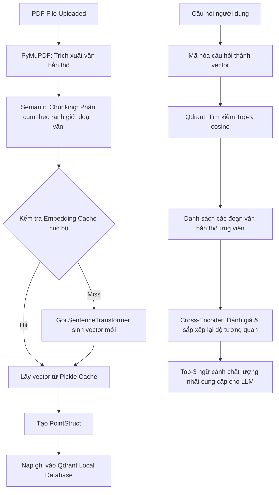

# Module: Backend Knowledge Base (RAG Search & Vector Database Manager)

## 1. Mô tả chi tiết (Detailed Description)
Module này chịu trách nhiệm quản lý hệ thống lưu trữ tri thức RAG (**Retrieval-Augmented Generation**), đóng vai trò là "bộ não phụ" chứa các văn bản tài liệu hướng dẫn tài chính, chính sách dịch vụ của công ty chứng khoán Kafi. Hệ thống được triển khai bằng sự kết hợp giữa cơ sở dữ liệu vector hiệu năng cao **Qdrant**, thư viện trích xuất tệp tin **PyMuPDF**, thuật toán **Semantic Chunking (Phân mảnh ngữ nghĩa)** và cơ chế **Embedding Cache** đặc biệt.

Quy trình nạp tài liệu PDF và truy xuất thông tin của hệ thống diễn ra như sau:

Các tính năng nổi bật trong thiết kế của module này bao gồm:
1.  **Semantic Chunking**: Thay vì cắt nhỏ văn bản một cách cơ học theo số lượng ký tự cố định (dễ làm đứt đoạn câu và mất nghĩa), thuật toán này phân tích các ranh giới xuống dòng tự nhiên (`\n\n`) để phân cụm. Các đoạn văn nhỏ được gộp lại, các đoạn quá dài (>800 từ) được chia tách có gối đầu (`overlap = 50 từ`). Kết quả là ngữ cảnh nạp vào mô hình luôn toàn vẹn và có chất lượng tốt nhất.
2.  **Pickle Embedding Cache**: Quá trình sinh vector embedding từ mô hình cục bộ rất tốn GPU/CPU. Module định nghĩa lớp `EmbeddingCache` ghi trực tiếp dữ liệu dạng `pickle` ra đĩa tại `data/embedding_cache.pkl`. Khi nạp tài liệu, hệ thống băm MD5 nội dung văn bản mảnh, nếu đã có trong cache thì đọc tức thì, giúp tốc độ nạp các file PDF lớn nhanh hơn gấp **10 - 50 lần** ở các lần chạy sau.
3.  **Metadata Tracking**: Toàn bộ vòng đời của tệp PDF tải lên (Trạng thái nạp: `processing`, `completed`, `error`) cùng thông báo lỗi chi tiết được ghi chép đồng bộ vào cơ sở dữ liệu SQLite cục bộ `data/knowledge_meta.sqlite` thông qua lớp `KnowledgeFileMetadata`.
4.  **Hỗ trợ Xóa hoàn toàn (Cascade Delete)**: Khi một tài liệu bị xóa, hệ thống xóa bản ghi khỏi SQLite metadata, đồng thời tạo một bộ lọc `models.FilterSelector` theo trường payload `source` để ra lệnh cho Qdrant dọn dẹp sạch sẽ toàn bộ các vector thuộc về tệp đó.

## 2. Nhiệm vụ và Trách nhiệm (Responsibilities)
-   **Quản lý Qdrant Client**: Khởi tạo kết nối lưu trữ cục bộ tới thư mục `data/qdrant_db/`, tự động tạo bộ sưu tập (`collection_name = "kafi_knowledge"`) với kích thước vector phù hợp và độ đo khoảng cách Cosine nếu chưa tồn tại.
-   **Trích xuất PDF**: Sử dụng thư viện `fitz` (PyMuPDF) để chuyển đổi tệp PDF sang văn bản thô (UTF-8).
-   **Cắt nhỏ văn bản**: Thực hiện thuật toán Phân mảnh Ngữ nghĩa (`chunk_text_semantic`).
-   **Mã hóa & Lưu trữ**:
    -   Phát hiện các đoạn văn bản chưa được mã hóa để gửi đi nhúng vector (chia nhỏ batch size = 8 để tránh tràn bộ nhớ).
    -   Đồng bộ ghi vector vào cache đĩa Pickle.
    -   Chuyển đổi dữ liệu sang danh sách `models.PointStruct` kèm payload metadata (`text`, `source`) để upsert vào Qdrant.
-   **Truy xuất RAG tối ưu**:
    -   Tìm kiếm vector thô trong Qdrant thu về `top_k_retrieve` (mặc định 10 ứng viên).
    -   Gọi mô hình Reranker để chấm điểm chéo mức độ tương quan thực tế giữa câu hỏi và ứng viên, trả về **Top-3** đoạn văn tốt nhất làm ngữ cảnh cho LLM.
-   **Quản lý Metadata SQLite**: Đăng ký, cập nhật trạng thái nạp ngầm, liệt kê danh sách file hiển thị trên UI sidebar và xóa dữ liệu liên quan.

## 3. Đầu vào (Inputs)
-   **Khi nạp**: Đường dẫn tệp tin PDF cục bộ.
-   **Khi truy xuất**: Câu hỏi của người dùng (đã được viết lại rõ nghĩa).
-   **Khi xóa**: Mã số định danh `file_id` (SQLite Primary Key).
-   **Cấu hình**: Cài đặt từ `pipeline.yaml` tại nhánh `knowledge`.

## 4. Đầu ra (Outputs)
-   **Khi nạp**: Điền đầy vector vào cơ sở dữ liệu Qdrant và ghi thông tin hoàn tất vào SQLite.
-   **Khi truy xuất**: Danh sách các chuỗi văn bản (contexts) chất lượng nhất, được xếp hạng từ cao xuống thấp để đưa vào prompt mở rộng cho AI.

## 5. File/Thư mục vật lý (Physical Files)
-   **Đường dẫn tuyệt đối**:
    -   Trình quản lý cơ sở dữ liệu vector: [knowledge_base.py](file:///c:/Users/Admin/Desktop/Kafi_chatbot/backend/src/utils/knowledge_base.py)
    -   Trình quản lý metadata file: [knowledge_manager.py](file:///c:/Users/Admin/Desktop/Kafi_chatbot/backend/src/utils/knowledge_manager.py)
-   **Đường dẫn tương đối**: `./backend/src/utils/knowledge_base.py` và `./backend/src/utils/knowledge_manager.py`
-   **Thư mục lưu trữ database**: `backend/data/qdrant_db/` và `backend/data/knowledge_meta.sqlite`
-   **Script nạp tri thức độc lập**: `backend/scripts/ingest_knowledge.py`

## 6. Liên kết Đồ thị (Graph Connections)
-   **Gọi đến (Calls to / Depends on):**
    -   [Backend_Embeddings.md](file:///c:/Users/Admin/Desktop/Kafi_chatbot/project_graph/Backend_Embeddings.md) (`./Backend_Embeddings.md`): Sử dụng `EmbeddingManager` nhúng vector câu hỏi và các đoạn văn.
    -   [Backend_Reranker.md](file:///c:/Users/Admin/Desktop/Kafi_chatbot/project_graph/Backend_Reranker.md) (`./Backend_Reranker.md`): Sử dụng `RerankerManager` để sắp xếp lại các tài liệu trả về từ DB.
    -   [Backend_Config.md](file:///c:/Users/Admin/Desktop/Kafi_chatbot/project_graph/Backend_Config.md) (`./Backend_Config.md`): Đọc cấu hình kích thước nến, số lượng Top-K từ `AppConfig`.
    -   [Backend_System_Monitor.md](file:///c:/Users/Admin/Desktop/Kafi_chatbot/project_graph/Backend_System_Monitor.md) (`./Backend_System_Monitor.md`): Ghi log tiến trình nạp, số lượng chunks, thời gian sinh vector và lỗi trích xuất.
-   **Được gọi bởi (Called by / Dependency of):**
    -   [Backend_Router_Chatbot.md](file:///c:/Users/Admin/Desktop/Kafi_chatbot/project_graph/Backend_Router_Chatbot.md) (`./Backend_Router_Chatbot.md`): Gọi nạp file PDF chạy ngầm, liệt kê danh sách tệp tri thức trên UI, và gọi xóa tệp tri thức.
    -   [Backend_Pipeline.md](file:///c:/Users/Admin/Desktop/Kafi_chatbot/project_graph/Backend_Pipeline.md) (`./Backend_Pipeline.md`): Gọi `kb.retrieve()` để lấy ngữ cảnh bổ sung vào prompt cho LLM khi phát hiện route `KNOWLEDGE`.
