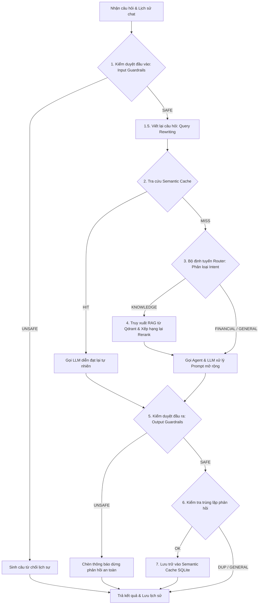

# Module: Backend Pipeline (Core RAG Conversational Pipeline)

## 1. Mô tả chi tiết (Detailed Description)
Module này là "trái tim" (Core Logic) điều phối toàn bộ quy trình xử lý hội thoại thông minh của hệ thống. Được định nghĩa trong lớp `ChatPipeline`, nó kết nối tất cả các thành phần AI đơn lẻ (nhập tri thức, kiểm duyệt an toàn, định tuyến chủ đề, ghi nhớ hội thoại và bộ đệm ngữ nghĩa) thành một luồng xử lý thống nhất và an toàn.

Kiến trúc xử lý một tin nhắn người dùng của `ChatPipeline` diễn ra cực kỳ chặt chẽ theo **8 giai đoạn tuần tự**:

Một điểm đặc biệt trong thiết kế là **luồng stream kết hợp kiểm duyệt an toàn định kỳ**: Ứng dụng vừa stream kết quả từng chữ về client vừa bộ đệm tích lũy văn bản. Cứ mỗi **300 ký tự** được sinh ra, hệ thống gọi Guardrails kiểm tra ngầm. Nếu phát hiện câu trả lời vi phạm an toàn ở giữa chừng, hệ thống chủ động ngắt dòng stream, chèn thông báo từ chối an toàn bằng tiếng Việt và dừng phản hồi lập tức để bảo vệ hệ thống.

Ngoài ra, hệ thống tích hợp bộ lọc tag cổ phiếu thông minh: Khi tin nhắn của người dùng chứa định danh cổ phiếu thuộc chỉ số VN30 dưới dạng `@SYMBOL` (ví dụ: `@FPT`, `@BID`), luồng xử lý sẽ nhận diện và chuyển tiếp trực tiếp sang **Stock Analysis Agent**. Trình xử lý này sẽ tự động nạp các chỉ số kỹ thuật (RSI, MACD, Bollinger Bands, SMA) và chỉ số rủi ro/thanh khoản lịch sử (Sharpe, Max Drawdown, VaR 95%), xây dựng một prompt chuyên gia định vị đầu tư tập trung vào:
- **Khuyến nghị rõ ràng** (Mua/Bán/Nắm giữ/Quan sát).
- **Vùng giá khuyến nghị** (Vùng mua, Mục tiêu, Cắt lỗ).
- **Thời gian nắm giữ & Tỷ trọng giải ngân** tối ưu.
Điều này giúp phản hồi của LLM luôn bám sát dữ liệu số liệu thực tế được tính toán offline một cách chính xác, súc tích và trực diện nhất.

## 2. Nhiệm vụ và Trách nhiệm (Responsibilities)
-   **Khởi tạo Hệ thống AI**: Tải cấu hình từ `pipeline.yaml` và liên kết instance của các module bổ trợ: `GuardrailsManager`, `RouterManager`, `EmbeddingManager`, `RerankerManager`, `KnowledgeBase`, và `SemanticCache`.
-   **Làm ấm mô hình (`warmup`)**: Gọi các tiến trình đảm bảo nạp mô hình vào VRAM trước khi nhận request đầu tiên.
-   **Kiểm duyệt an toàn 2 đầu**: Thực hiện chặn đứng câu hỏi độc hại (Input Guardrails) và lọc câu trả lời nhạy cảm (Output Guardrails).
-   **Viết lại câu hỏi (Query Rewriting)**: Chuyển đổi các câu hỏi chứa đại từ nhân xưng phụ thuộc bối cảnh thành câu hỏi độc lập đầy đủ ý nghĩa.
-   **Quản lý Bộ đệm Ngữ nghĩa**:
    -   Lookup: So sánh độ tương đồng cosine vector câu hỏi hiện tại với kho dữ liệu SQLite.
    -   Store: Lưu trữ các giao dịch thành công (chỉ lưu các câu hỏi chuyên ngành FINANCIAL/KNOWLEDGE, bỏ qua GENERAL để tránh rác cache).
    -   Duplicate prevention: Kiểm tra xem câu trả lời mới sinh ra có bị trùng lặp nội dung với một phản hồi đã lưu trước đó không để tiết kiệm bộ nhớ.
-   **Truy xuất & Mở rộng Prompt (RAG Context Augmentation)**: Nếu bộ định tuyến chọn nhánh tri thức `KNOWLEDGE`, tiến hành tìm kiếm các đoạn văn liên quan nhất, sau đó cấu trúc lại prompt dạng `--- TÀI LIỆU ---` và `--- CÂU HỎI ---` để LLM trả lời chuẩn xác theo tài liệu công ty.
-   **Lập vết giao dịch (Execution Tracing)**: Tạo snapshot `PipelineTrace` ghi nhận kết quả rẽ nhánh và an toàn của giao dịch gần nhất, hỗ trợ debug qua giao diện quản trị.

## 3. Đầu vào (Inputs)
-   `user_text` (chuỗi ký tự): Câu hỏi thô của người dùng.
-   `history` (danh sách tin nhắn dạng Role-Content): Bối cảnh hội thoại hiện tại.
-   `session_id` (tùy chọn - chuỗi ký tự): Mã định danh phiên dùng để lưu trữ tin nhắn tự động.

## 4. Đầu ra (Outputs)
-   `Generator[str, None, None]`: Luồng stream các chunk text phản hồi gửi về cho router.
-   Cập nhật lịch sử chat: Tự động chèn tin nhắn của user và AI vào cơ sở dữ liệu in-memory qua Session Manager.
-   `PipelineTrace`: Đối tượng chứa thông tin vết chạy ngầm.

## 5. File/Thư mục vật lý (Physical Files)
-   **Đường dẫn tuyệt đối**: [chat_pipeline.py](file:///c:/Users/Admin/Desktop/Kafi_chatbot/backend/src/pipeline/chat_pipeline.py)
-   **Đường dẫn tương đối**: `./backend/src/pipeline/chat_pipeline.py`

## 6. Liên kết Đồ thị (Graph Connections)
-   **Gọi đến (Calls to / Depends on):**
    -   [Backend_Agents.md](file:///c:/Users/Admin/Desktop/Kafi_chatbot/project_graph/Backend_Agents.md) (`./Backend_Agents.md`): Gọi `rewrite_query` để làm sạch câu hỏi và `process_chat` để phối hợp LLM trả lời.
    -   [Backend_Conversation.md](file:///c:/Users/Admin/Desktop/Kafi_chatbot/project_graph/Backend_Conversation.md) (`./Backend_Conversation.md`): Lưu trữ tin nhắn mới của người dùng và trợ lý ảo vào lịch sử phiên qua Session Manager.
    -   [Backend_Embeddings.md](file:///c:/Users/Admin/Desktop/Kafi_chatbot/project_graph/Backend_Embeddings.md) (`./Backend_Embeddings.md`): Tạo vector embedding câu hỏi để tra cứu bộ đệm và RAG.
    -   [Backend_Reranker.md](file:///c:/Users/Admin/Desktop/Kafi_chatbot/project_graph/Backend_Reranker.md) (`./Backend_Reranker.md`): Gọi để tối ưu thứ tự tài liệu tri thức trả về.
    -   [Backend_Knowledge_Base.md](file:///c:/Users/Admin/Desktop/Kafi_chatbot/project_graph/Backend_Knowledge_Base.md) (`./Backend_Knowledge_Base.md`): Gọi hàm `kb.retrieve()` truy xuất tài liệu trong Qdrant.
    -   [Backend_Guardrails.md](file:///c:/Users/Admin/Desktop/Kafi_chatbot/project_graph/Backend_Guardrails.md) (`./Backend_Guardrails.md`): Gọi `guardrails.check()` để duyệt tính an toàn.
    -   [Backend_Query_Router.md](file:///c:/Users/Admin/Desktop/Kafi_chatbot/project_graph/Backend_Query_Router.md) (`./Backend_Query_Router.md`): Phân loại câu hỏi thành FINANCIAL, KNOWLEDGE, hoặc GENERAL.
    -   [Backend_Semantic_Cache.md](file:///c:/Users/Admin/Desktop/Kafi_chatbot/project_graph/Backend_Semantic_Cache.md) (`./Backend_Semantic_Cache.md`): Gọi `cache.lookup()` để kiểm tra cache và `cache.store()` để ghi nhớ.
    -   [Backend_Config.md](file:///c:/Users/Admin/Desktop/Kafi_chatbot/project_graph/Backend_Config.md) (`./Backend_Config.md`): Tải thông tin cài đặt hệ thống.
    -   [Backend_System_Monitor.md](file:///c:/Users/Admin/Desktop/Kafi_chatbot/project_graph/Backend_System_Monitor.md) (`./Backend_System_Monitor.md`): Ghi log toàn bộ tiến trình.
-   **Được gọi bởi (Called by / Dependency of):**
    -   [Backend_Main.md](file:///c:/Users/Admin/Desktop/Kafi_chatbot/project_graph/Backend_Main.md) (`./Backend_Main.md`): Khởi động nạp trước các model cục bộ lúc chạy ứng dụng.
    -   [Backend_Router_Chatbot.md](file:///c:/Users/Admin/Desktop/Kafi_chatbot/project_graph/Backend_Router_Chatbot.md) (`./Backend_Router_Chatbot.md`): Router chính gọi pipeline xử lý hội thoại và truy xuất vết trace.
