# BẢN ĐỒ KIẾN TRÚC DỰ ÁN (PROJECT ARCHITECTURE GRAPH)

Tài liệu này là **bản đồ toàn cảnh** mô tả kiến trúc hệ thống của **Kafi Chatbot**. Mỗi tệp tin `.md` trong thư mục `project_graph/` đại diện cho một **Node** (Mô-đun) độc lập trong đồ thị kiến trúc tổng thể. Thiết kế này giúp các lập trình viên và các trợ lý AI dễ dàng hiểu rõ mối quan hệ, đầu vào, đầu ra và đường dẫn vật lý của từng thành phần khi cập nhật hoặc phát triển dự án.

---

## 🗺️ Sơ đồ Kiến trúc Hệ thống (Expanded Architecture Diagram)

Dưới đây là sơ đồ chi tiết, kích thước lớn biểu diễn cách các mô-đun trong hệ thống kết nối, gọi và phụ thuộc lẫn nhau. Sơ đồ được mã hóa màu sắc để bạn dễ dàng phân biệt các phân lớp chức năng:

- 🟢 **Xanh lá (Client)**: Giao diện người dùng và Trình duyệt.
- 🔵 **Xanh dương (API Gateway / Routers)**: Lớp tiếp nhận và xác thực API.
- 🟣 **Tím (Orchestration & Memory)**: Lớp điều phối hội thoại và quản lý bộ nhớ.
- 🟤 **Nâu (Database & RAG Storage)**: Lớp lưu trữ vector và metadata tài liệu.
- 🔴 **Đỏ (AI & NLP Engines)**: Mô hình học sâu cục bộ và đám mây.
- 🍀 **Emerald (Infrastructure / Utilities)**: Tiện ích hệ thống và cấu hình phần cứng.

```mermaid
graph TD
    %% Định nghĩa các lớp CSS cho node (Không dùng dấu chấm phẩy ở cuối)
    classDef client fill:#1f2937,stroke:#10b981,stroke-width:2px,color:#fff
    classDef entry fill:#1e3a8a,stroke:#3b82f6,stroke-width:2px,color:#fff
    classDef orchestrator fill:#312e81,stroke:#6366f1,stroke-width:2px,color:#fff
    classDef database fill:#3b2314,stroke:#f97316,stroke-width:2px,color:#fff
    classDef ai fill:#4c1d95,stroke:#8b5cf6,stroke-width:2px,color:#fff
    classDef infra fill:#064e3b,stroke:#059669,stroke-width:2px,color:#fff

    %% 1. Khai báo các Nodes chính kèm Link tài liệu (Bọc nhãn bằng dấu nháy kép để tránh lỗi cú pháp)
    User(["Người dùng / Client Browser"]):::client
    Frontend_App["Frontend App: React Vite SPA (./Frontend_App.md)"]:::client

    Backend_Main["Backend Main: FastAPI Entrypoint (./Backend_Main.md)"]:::entry
    Backend_Router_Chatbot["Router Chatbot: chatbot.py (./Backend_Router_Chatbot.md)"]:::entry
    Backend_Router_Market["Router Market: market_data.py (./Backend_Router_Market.md)"]:::entry
    Backend_Router_VN30["Router VN30: vn30.py (./Backend_Router_VN30.md)"]:::entry
    Backend_Schemas["Schemas: chat_schema.py (./Backend_Schemas.md)"]:::entry

    Backend_Pipeline["Pipeline: chat_pipeline.py (./Backend_Pipeline.md)"]:::orchestrator
    Backend_Agents["Agents: financial_agent.py (./Backend_Agents.md)"]:::orchestrator
    Backend_Conversation["Conversation: session_manager.py (./Backend_Conversation.md)"]:::orchestrator

    Backend_Knowledge_Base["Knowledge Base: Qdrant & SQLite (./Backend_Knowledge_Base.md)"]:::database

    Backend_LLM["LLM Manager: llm.py & hf_textgen.py (./Backend_LLM.md)"]:::ai
    Backend_Semantic_Cache["Semantic Cache: cache.py & SQLite (./Backend_Semantic_Cache.md)"]:::ai
    Backend_Guardrails["Guardrails: guardrails.py (./Backend_Guardrails.md)"]:::ai
    Backend_Query_Router["Query Router: router.py (./Backend_Query_Router.md)"]:::ai
    Backend_Embeddings["Embeddings: embeddings.py (./Backend_Embeddings.md)"]:::ai
    Backend_Reranker["Reranker: reranker.py (./Backend_Reranker.md)"]:::ai

    Backend_Config["Config Loader: app_config.py (./Backend_Config.md)"]:::infra
    Backend_App_Mode["App Mode Manager: app_mode.py (./Backend_App_Mode.md)"]:::infra
    Backend_Market_Exporter["Market Exporter: market_exporter.py (./Backend_Market_Exporter.md)"]:::infra
    Backend_System_Monitor["System Monitor: logger.py & vram.py (./Backend_System_Monitor.md)"]:::infra

    %% 2. Thiết lập liên kết Đồ thị (Connections)
    User ---|"HTTP, SSE, WebSockets"| Frontend_App

    Frontend_App -->|"1. Chat & Upload PDF"| Backend_Router_Chatbot
    Frontend_App -->|"2. Polling VN30 Quotes/Candles"| Backend_Router_VN30
    Frontend_App -->|"3. Gold Chart Candles"| Backend_Router_Market

    Backend_Main -->|"FastAPI Startup"| Backend_Router_Chatbot
    Backend_Main -->|"FastAPI Startup"| Backend_Router_Market
    Backend_Main -->|"FastAPI Startup"| Backend_Router_VN30
    Backend_Main -->|"Preloads Models"| Backend_Pipeline

    Backend_Router_Chatbot -->|"Xác thực Đầu vào"| Backend_Schemas
    Backend_Router_Chatbot -->|"Đọc Lịch sử Chat"| Backend_Conversation
    Backend_Router_Chatbot -->|"Lưu & Xóa File PDF"| Backend_Knowledge_Base
    Backend_Router_Chatbot -->|"Đổi Chế độ CHAT/INDEXING"| Backend_App_Mode
    Backend_Router_Chatbot -->|"Truyền Câu hỏi"| Backend_Pipeline

    Backend_Router_VN30 -->|"Kích hoạt Xuất CSV"| Backend_Market_Exporter

    Backend_Pipeline -->|"Kiểm duyệt độc hại đầu vào/ra"| Backend_Guardrails
    Backend_Pipeline -->|"Viết lại câu hỏi làm rõ đại từ"| Backend_Agents
    Backend_Pipeline -->|"Tra cứu & Lưu trữ Cache"| Backend_Semantic_Cache
    Backend_Pipeline -->|"Định tuyến Intent"| Backend_Query_Router
    Backend_Pipeline -->|"Truy xuất Tri thức"| Backend_Knowledge_Base
    Backend_Pipeline -->|"Đồng bộ ghi Lịch sử"| Backend_Conversation

    Backend_Agents -->|"Gọi Suy luận tạo Văn bản"| Backend_LLM

    Backend_Knowledge_Base -->|"Mã hóa mảnh văn bản"| Backend_Embeddings
    Backend_Knowledge_Base -->|"Tái sắp xếp tài liệu RAG"| Backend_Reranker

    Backend_App_Mode -->|"Giải phóng VRAM GPU"| Backend_LLM
    Backend_App_Mode -->|"Giải phóng VRAM GPU"| Backend_Query_Router
    Backend_App_Mode -->|"Dịch chuyển CUDA <-> CPU"| Backend_Embeddings

    %% 3. Cấu hình & Giám sát hệ thống (Hệ thống đường kẻ mờ/chấm để biểu diễn tính toàn cục)
    Backend_Pipeline -.->|"Log Tracing & Metrics"| Backend_System_Monitor
    Backend_LLM -.->|"Theo dõi VRAM"| Backend_System_Monitor
    Backend_Router_Chatbot -.->|"Đọc Cấu hình"| Backend_Config
    Backend_Pipeline -.->|"Đọc Cấu hình"| Backend_Config
```

---

## 📂 Danh mục Mô tả các Node (Mô-đun) trong Đồ thị

Bạn có thể click trực tiếp vào các liên kết bên dưới để mở tài liệu chi tiết của từng Node:

### 1. Phân lớp Core & Entry

- **[Backend_Main.md](file:///c:/Users/Admin/Desktop/Kafi_chatbot/project_graph/Backend_Main.md)**: File điểm vào FastAPI (`main.py`), quản lý luồng ngầm khởi động, CORS.
- **[Frontend_App.md](file:///c:/Users/Admin/Desktop/Kafi_chatbot/project_graph/Frontend_App.md)**: Giao diện dashboard React/Vite SPA (`App.tsx`), Lightweight-charts, LaTeX render, SSE Streaming.

### 2. Phân lớp API Routers & Schemas

- **[Backend_Router_Chatbot.md](file:///c:/Users/Admin/Desktop/Kafi_chatbot/project_graph/Backend_Router_Chatbot.md)**: Các endpoints phục vụ hội thoại, đổi mô hình, upload và xóa PDF tri thức, đổi chế độ ứng dụng.
- **[Backend_Router_Market.md](file:///c:/Users/Admin/Desktop/Kafi_chatbot/project_graph/Backend_Router_Market.md)**: API phục vụ dữ liệu biểu đồ nến vàng lịch sử từ tệp `gold_data.csv`.
- **[Backend_Router_VN30.md](file:///c:/Users/Admin/Desktop/Kafi_chatbot/project_graph/Backend_Router_VN30.md)**: API phục vụ rổ VN30, Quotes thời gian thực (polling 5s), biểu đồ 15m/EOD, bộ đệm Quotes kép.
- **[Backend_Schemas.md](file:///c:/Users/Admin/Desktop/Kafi_chatbot/project_graph/Backend_Schemas.md)**: Các lớp Pydantic xác thực dữ liệu đầu vào và tuần tự hóa phản hồi API.

### 3. Phân lớp Điều phối & Bộ nhớ (Orchestration & Memory)

- **[Backend_Pipeline.md](file:///c:/Users/Admin/Desktop/Kafi_chatbot/project_graph/Backend_Pipeline.md)**: Trình điều phối `ChatPipeline` với 8 bước xử lý: Input Guardrails, Query Rewriter, Semantic Cache, Query Router, RAG Vector Search & Rerank, Agent inference, Output Guardrails, và Cache Storage.
- **[Backend_Agents.md](file:///c:/Users/Admin/Desktop/Kafi_chatbot/project_graph/Backend_Agents.md)**: `FinancialAgent` chịu trách nhiệm viết lại câu hỏi bám sát ngữ cảnh (giải quyết đại từ nhân xưng mơ hồ) và ủy thác LLM trả lời.
- **[Backend_Conversation.md](file:///c:/Users/Admin/Desktop/Kafi_chatbot/project_graph/Backend_Conversation.md)**: Trình quản lý session hội thoại thread-safe (sử dụng khóa `Lock`), tự động cắt ngắn lịch sử để tránh phình VRAM.

### 4. Phân lớp Nhận diện & Trích xuất tri thức (RAG Search)

- **[Backend_Knowledge_Base.md](file:///c:/Users/Admin/Desktop/Kafi_chatbot/project_graph/Backend_Knowledge_Base.md)**: Trình quản lý tri thức RAG kết nối Qdrant, trích xuất PyMuPDF, cắt mảnh ngữ nghĩa (Semantic Chunking), lưu cache vector dạng `pickle` trên đĩa và SQLite metadata file.

### 5. Phân lớp Mô hình AI & NLP Cục bộ

- **[Backend_LLM.md](file:///c:/Users/Admin/Desktop/Kafi_chatbot/project_graph/Backend_LLM.md)**: Lớp quản lý mô hình ngôn ngữ lớn chính (hỗ trợ Causal/Multimodal), lượng tử hóa nén VRAM (4/8-bit), thu hồi VRAM CUDA triệt để khi đổi mô hình, đo lường tốc độ TTFT.
- **[Backend_Semantic_Cache.md](file:///c:/Users/Admin/Desktop/Kafi_chatbot/project_graph/Backend_Semantic_Cache.md)**: Bộ đệm ngữ nghĩa SQLite, chuyển đổi mảng NumPy float32 nhị phân BLOB, tính khoảng cách Cosine cục bộ siêu tốc, ngăn chặn trùng lặp câu trả lời.
- **[Backend_Guardrails.md](file:///c:/Users/Admin/Desktop/Kafi_chatbot/project_graph/Backend_Guardrails.md)**: Kiểm duyệt an toàn hai đầu bằng biểu thức chính quy (Regex Blocklist) chống bẻ khóa prompt cùng mô hình phân loại cục bộ.
- **[Backend_Query_Router.md](file:///c:/Users/Admin/Desktop/Kafi_chatbot/project_graph/Backend_Query_Router.md)**: Bộ phân loại câu hỏi (Intent Router) phân loại chính xác truy vấn thành FINANCIAL, KNOWLEDGE hoặc GENERAL.
- **[Backend_Embeddings.md](file:///c:/Users/Admin/Desktop/Kafi_chatbot/project_graph/Backend_Embeddings.md)**: Mô hình SentenceTransformers mã hóa vector, hỗ trợ hoán chuyển thiết bị động CPU <-> GPU để tiết kiệm VRAM.
- **[Backend_Reranker.md](file:///c:/Users/Admin/Desktop/Kafi_chatbot/project_graph/Backend_Reranker.md)**: Mô hình Cross-Encoder chấm điểm tương quan chéo chính xác giữa câu hỏi và văn bản tri thức thô.

### 6. Phân lớp Hạ tầng & Tiện ích hệ thống (Infrastructure)

- **[Backend_Config.md](file:///c:/Users/Admin/Desktop/Kafi_chatbot/project_graph/Backend_Config.md)**: Bộ nạp biến môi trường `.env` và tệp cấu hình YAML (`llms.yaml`, `pipeline.yaml`, v.v.).
- **[Backend_App_Mode.md](file:///c:/Users/Admin/Desktop/Kafi_chatbot/project_graph/Backend_App_Mode.md)**: Bộ quản lý trạng thái, tự động giải phóng VRAM (dọn GPU) khi đổi từ CHAT sang INDEXING và nạp lại mô hình.
- **[Backend_Market_Exporter.md](file:///c:/Users/Admin/Desktop/Kafi_chatbot/project_graph/Backend_Market_Exporter.md)**: Tiện ích xuất dữ liệu nến lịch sử VN30 5 năm ra các file CSV cục bộ.
- **[Backend_System_Monitor.md](file:///c:/Users/Admin/Desktop/Kafi_chatbot/project_graph/Backend_System_Monitor.md)**: Nhật ký Rich Handler, log bảng biểu Agent/Tool/Metrics trực quan và giám sát rò rỉ dung lượng VRAM thực tế.

---

## 📈 Lợi ích của Bản đồ Kiến trúc Đồ thị này

1.  **Dễ dàng Hiểu & Cập nhật**: Mỗi khi bạn thay đổi mã nguồn trong một tệp tin (ví dụ: `vn30.py`), bạn chỉ cần tìm file tương ứng trong bản đồ (`Backend_Router_VN30.md`), xem cột **Liên kết Đồ thị** để biết ngay những mô-đun nào sẽ bị ảnh hưởng, từ đó kiểm thử chính xác và tránh gây lỗi lan truyền.
2.  **Hỗ trợ AI Tối đa**: Khi bạn đưa bối cảnh dự án này cho các AI assistant, AI sẽ có ngay một bản đồ toàn cảnh sắc nét về hệ thống của bạn, từ đó đưa ra các đề xuất code chuẩn xác, đúng vị trí và không làm xáo trộn cấu trúc chung.
3.  **Tích hợp click mở file nhanh**: Chỉ cần click vào tên file hoặc đường dẫn tuyệt đối trong tài liệu, IDE sẽ tự động mở file mã nguồn đích để bạn bắt tay vào chỉnh sửa ngay lập tức!
